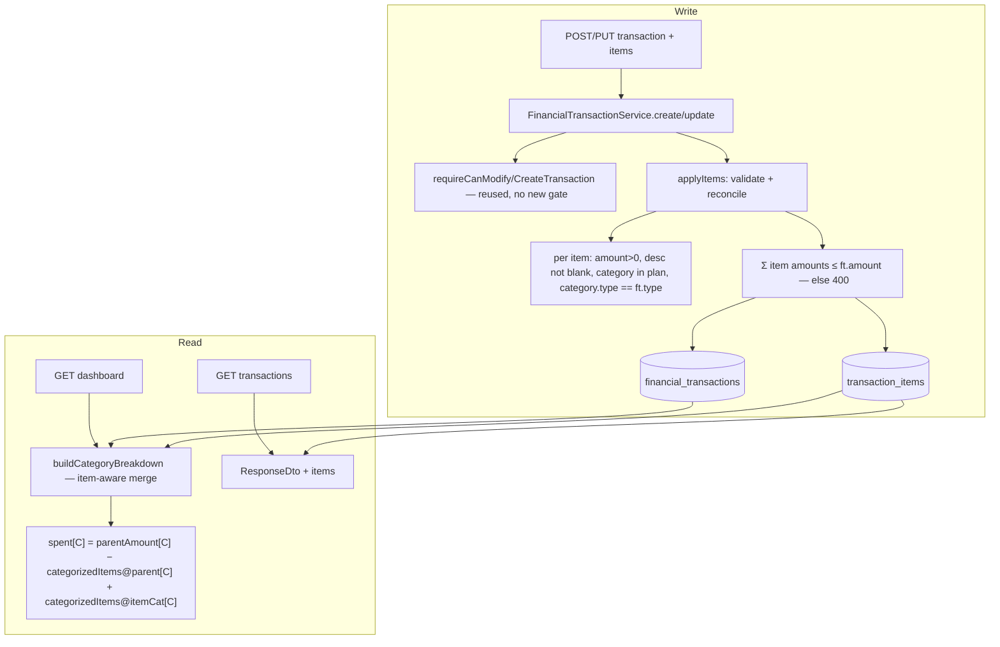

# Transaction Line Items — Design

**Spec**: `./spec.md`
**Status**: Draft (awaiting approval before Tasks)

---

## Architecture Overview

A new child table `transaction_items` hangs off `financial_transactions` exactly like `transaction_participants`
does — `@OneToMany(cascade=ALL, orphanRemoval=true)`, owned and reconciled by the parent on create/update.
Each item carries its **own** `category` and `amount`. Writes flow through a new `applyItems(...)` helper in
`FinancialTransactionService`, mirroring `applyParticipants`. The **only** read path that changes is the
dashboard **category breakdown** (`findCategoryBreakdown`), which becomes item-aware. Everything else —
totals, monthly trend, person breakdown — is untouched because it aggregates `ft.amount` / `tp.shareAmount`
at the transaction level.



**Key principle — the Partition Invariant (from spec):** a transaction's `amount` is sliced across category
buckets exactly once. Because `Σitems ≤ amount` is enforced on write, the parent-category "remainder" bucket
is always ≥ 0, and the slices always sum back to `amount`. The **top-line totals never move** — they don't
read categories at all (`sumByPlanAndTypeAndDateRange` sums `ft.amount` by type, verified).

---

## The item-aware category breakdown (the only genuinely new logic)

**Today** (`findCategoryBreakdown`): `SUM(ft.amount)` grouped by `ft.category` — the whole amount lands in one
category. **New**: a category `C`'s spend comes from two sources — items categorized as `C`, plus the
un-itemized-or-uncategorized remainder of transactions whose *parent* category is `C`.

The remainder algebra makes this three plain aggregations, no per-row subquery:

```
For a transaction t:  amount = Σ(categorized items) + Σ(uncategorized items) + remainder
⇒ parent-bucket portion of t = Σ(uncategorized items) + remainder = amount − Σ(categorized items of t)

⇒ spent[C] =  A[C]              parent amount:  SUM(ft.amount)          grouped by ft.category   (= today's query)
            − B[C]              categorized items, SUM(it.amount)       grouped by ft.category (parent)
            + I[C]              categorized items, SUM(it.amount)       grouped by it.category (item's own)
```

**Worked example** — grocery 150 (parent = Groceries); items Food 90, Cleaning 40; remainder 20:

| C | A (parent amt) | B (cat. items @parent) | I (cat. items @item) | spent = A−B+I |
| --- | --- | --- | --- | --- |
| Groceries | 150 | 130 | 0 | **20** ✓ (remainder) |
| Food | 0 | 0 | 90 | **90** ✓ |
| Cleaning | 0 | 0 | 40 | **40** ✓ |

A non-itemized transaction: `A=amount, B=0, I=0 ⇒ spent=amount` (identical to today). ✓

Three queries merged in Java into a `Map<categoryId, spent>` — this matches the codebase's house style
(JPQL aggregates, service maps rows). `A` is the **existing** query, extended only to return `category.id` as
a stable key. `B` and `I` are new. Then the existing zero-limit back-fill pass runs unchanged over
`findAllByPlan`. PLAN-07 limit evaluation is downstream in the `CategoryBreakdownDto` constructor
(`overLimit`/`remaining`/`percentUsed`) and needs **no** change — it just receives the new `spent`.

### Design decision — no "Uncategorized" bucket in v1

The current breakdown filters `ft.category IS NOT NULL` (category-less transactions are already invisible in
it). We **keep** that: the parent-bucket term `A`/`B` stays filtered to non-null parent categories, so a
category-less transaction's remainder stays out of the breakdown, exactly as today. **But** a *categorized
item* on a category-less transaction still surfaces under its own item category (term `I` has no parent-null
filter) — pure upside. This avoids introducing a new "Uncategorized" row (a behavior change to an existing
surface) while still delivering the itemization value. Spec ITEM-04-AC2's "or Uncategorized" is therefore
realized as "stays out of the breakdown, same as today." **Flag for approval** — if you'd rather see an
explicit Uncategorized bucket, that's a small additive change, but it alters the existing dashboard for
today's category-less rows.

---

## Code Reuse Analysis

### Existing components to leverage (verified)

| Component | Location | How to use |
| --- | --- | --- |
| `TransactionParticipant` + `@OneToMany` pattern | `models/TransactionParticipant.java`, `models/FinancialTransaction.java:51` | Direct template for `TransactionItem` + the `items` collection (getter-only, in-place mutation). |
| `applyParticipants` | `services/FinancialTransactionService.java` | Blueprint for `applyItems` (validate + replace child collection on create/update). |
| `requireCanCreateTransaction` / `requireCanModifyTransaction` | `security/PlanAuthorization.java` | Reused **unchanged** — items are not attribution-sensitive, so **no new authz gate** (unlike splitting). |
| `findCategoryBreakdown` + `buildCategoryBreakdown` | `repositories/FinancialTransactionRepository.java`, `services/DashboardService.java` | Extend query to carry `category.id`; rewrite the builder to merge A−B+I. Zero-limit back-fill pass reused as-is. |
| `CategoryBreakdownDto` | `dtos/response/CategoryBreakdownDto.java` | **Unchanged** — still `(name, spent, limit)`; only `spent` is computed differently upstream. PLAN-07 logic intact. |
| `FinancialTransactionCategoryService` / repo | `services/`, `repositories/` | Resolve + validate each item's `categoryId` (in plan, `category.type == ft.type`) — same rule the transaction category already uses. |
| Category response nesting | `dtos/response/FinancialTransactionCategoryResponseDto.java` | Reuse as the nested `category` inside the item response DTO. |
| Flyway | `src/main/resources/db/migration/` (last = `V6`) | New additive migration (next number — **re-verify at Execute**, see L-004). |
| **FE** `TransactionFormDrawer` + `CategoryCombobox` | `features/home/components/transactions/` | Repeatable items section reuses the category picker per row. |
| **FE** `form-creation` skill (`useFieldArray`) | skill | Repeatable field group pattern for the items list. |
| **FE** service hook + `buildMutationOptions` | `api/services/useFinancialTransactionService.ts` | Extend request body with `items`; existing invalidation already refetches dashboard + list. |
| **FE** full-body inline update contract | `transactionColumns.tsx` / `TransactionsTab.handleInlineSave` (see STATE `transaction-update-contract`) | Inline edits already send the full transaction body — items must be carried along (see Error Handling). |

### Integration points

| System | Integration |
| --- | --- |
| Flyway | One additive migration: create `transaction_items`. **No backfill** (existing transactions correctly have zero items ⇒ full amount → parent, unchanged). No new column on `financial_transactions`. |
| Dashboard totals / monthly trend / person breakdown | **Unchanged** — aggregate `ft.amount`/`tp.shareAmount`; independent of items (verified). |
| Category breakdown / PLAN-07 limits | Item-aware `spent` (A−B+I); DTO + limit math unchanged. |
| Participants / split | **Orthogonal** — `applyItems` and `applyParticipants` never interact; items don't touch `shareAmount`/`splitMode`. |
| CSV import | Imported transactions have no items (unchanged). |
| Recurring series | P3 — generator stamps items per occurrence; deferred (a series generates item-less occurrences until then). |

---

## Data Models

### Migration `V7__add_transaction_items.sql` (number to be re-verified at Execute)

```sql
CREATE TABLE transaction_items (
    id             BIGINT GENERATED BY DEFAULT AS IDENTITY PRIMARY KEY,
    transaction_id BIGINT        NOT NULL REFERENCES financial_transactions(id) ON DELETE CASCADE,
    category_id    BIGINT            NULL REFERENCES financial_transaction_categories(id),
    description    VARCHAR(255)  NOT NULL,
    amount         NUMERIC(19,2) NOT NULL,
    quantity       INTEGER       NOT NULL DEFAULT 1,
    CONSTRAINT chk_txn_item_amount_positive CHECK (amount > 0),
    CONSTRAINT chk_txn_item_qty_positive    CHECK (quantity > 0)
);
CREATE INDEX idx_txn_items_txn      ON transaction_items(transaction_id);
CREATE INDEX idx_txn_items_category ON transaction_items(category_id);
```

> `NUMERIC(19,2)` mirrors `transaction_participants.share_amount` / `BigDecimal` scale-2 usage. `category_id`
> nullable + `ON DELETE` **not** cascaded (mirrors `financial_transactions.category` — a RESTRICT default;
> category deletion behavior is unchanged from transactions). `quantity` column ships now (schema changes are
> the expensive part) but is only wired into DTO/form in P2. No backfill.

### Entity `TransactionItem` (new)

```java
@Entity @Table(name = "transaction_items")
class TransactionItem {
    Long id;
    @ManyToOne(optional=false) @JoinColumn(name="transaction_id") FinancialTransaction transaction;
    @ManyToOne @JoinColumn(name="category_id") FinancialTransactionCategory category; // nullable
    String description;      // NOT NULL
    BigDecimal amount;       // NOT NULL, > 0
    Integer quantity;        // NOT NULL default 1 (P2 in UI; line total stays in `amount`)
}
```

### `FinancialTransaction` (change — mirrors `participants`)

```java
@OneToMany(mappedBy="transaction", cascade=ALL, orphanRemoval=true)
List<TransactionItem> items = new ArrayList<>();   // getter-only, mutated in place
// amount, category, type, participants, splitMode ... UNCHANGED
```

### DTOs

```java
// request — nested in FinancialTransactionRequestDto:  @Valid List<ItemInputDto> items
class ItemInputDto {
    @NotBlank String description;
    @NotNull @Positive BigDecimal amount;
    Long categoryId;                 // optional
    @Positive Integer quantity;      // optional, default 1
}

// response — nested in FinancialTransactionResponseDto:  List<ItemDto> items
class ItemDto {
    Long id; String description; BigDecimal amount; Integer quantity;
    FinancialTransactionCategoryResponseDto category; // null when uncategorized
}
```

### FE types (`src/api/dtos/financialTransaction.ts`)

```ts
type TransactionItem = { id: number; description: string; amount: number; quantity: number;
                         category?: FinancialTransactionCategory };
type ItemInput = { description: string; amount: number; categoryId?: number; quantity?: number };
// FinancialTransaction gains:  items: TransactionItem[]
// Create/Update body gains:    items?: ItemInput[]
```

---

## Components

### `applyItems` (new — `FinancialTransactionService`)
- **Purpose**: validate and (re)build a transaction's item collection on create/update.
- **Interface**: `private void applyItems(FinancialTransaction txn, List<ItemInputDto> items, PlanContext ctx)`
- **Logic**:
  1. Null/empty → clear items (no items is valid). Otherwise, for each input:
     - `description` not blank, `amount > 0`, `quantity` ≥ 1 (default 1).
     - if `categoryId` present → resolve via `FinancialTransactionCategoryService` (must be in `ctx.getPlan()`),
       and assert `category.type == txn.getType()` — reuse the exact rule transaction category already applies.
  2. Enforce `Σ item.amount ≤ txn.getAmount()` → else `IllegalArgumentException` (→ 400).
  3. **Replace**: `txn.getItems().clear();` then add the resolved items (orphanRemoval deletes the old rows).
     Items have no business key, so full-replace (not reconcile-by-key) is the right call and matches the
     PUT full-replace contract.
- **Wiring**: `create` calls it before `save`; `update` calls it after `requireCanModifyTransaction`.
- **Reuses**: `financialTransactionCategoryService`, `planAuthorization` (already injected).

### Item-aware `buildCategoryBreakdown` (rewrite — `DashboardService`)
- **Purpose**: compute per-category `spent` as `A[C] − B[C] + I[C]`.
- **New repo queries** (`FinancialTransactionRepository`):
  - `A` — extend existing `findCategoryBreakdown` to also select `ft.category.id` (stable map key).
  - `B` — `SELECT ft.category.id, COALESCE(SUM(it.amount),0) FROM FinancialTransaction ft JOIN ft.items it WHERE ft.plan=:plan AND ft.type=:type AND ft.category IS NOT NULL AND it.category IS NOT NULL AND ft.startDate BETWEEN :s AND :e GROUP BY ft.category.id`
  - `I` — `SELECT it.category.id, it.category.description, it.category.spendingLimit, COALESCE(SUM(it.amount),0) FROM FinancialTransaction ft JOIN ft.items it WHERE ft.plan=:plan AND ft.type=:type AND it.category IS NOT NULL AND ft.startDate BETWEEN :s AND :e GROUP BY it.category.id, it.category.description, it.category.spendingLimit`
- **Merge**: build `Map<catId → {name, limit, spent}>` from `A` and `I` (union of keys), subtract `B` by
  parent-cat key; then the existing zero-limit back-fill pass over `findAllByPlan`; sort by `spent` desc.
- **Reuses**: `CategoryBreakdownDto` and the limit math unchanged.

### RecurringTransactionGenerator (P3 — deferred)
- Stamp a copy of the resolved items into each generated occurrence (mirrors participant stamping). Not in the
  P1/P2 cut; a series generates item-less occurrences until built.

### FE — items section in `TransactionFormDrawer` (P1) + table indicator (P2)
- **P1**: a repeatable "Items" field group (`useFieldArray`) — rows of {description, amount, category (reuse
  `CategoryCombobox`, filtered to the form's current type)}, add/remove, and a live **remainder**
  (`amount − Σitems`) with a zod refinement blocking submit when `Σitems > amount`. Pre-load items in edit
  mode. Follow the `form-creation` skill (module-scope schema, `Controller` for the category combobox).
- **P2**: quantity input per row; transactions-table indicator (item count) + a way to view items.

---

## Error Handling Strategy

| Scenario | Handling | User sees |
| --- | --- | --- |
| `Σ item.amount > transaction.amount` | `IllegalArgumentException` → `GlobalExceptionHandler` 400; zod refinement blocks client-side | "Items cannot exceed the transaction total." |
| Item `amount ≤ 0` or blank description | Bean validation (`@Positive`/`@NotBlank`) → 400 | Field-level error. |
| Item `categoryId` not in plan / soft-deleted | 400 via category resolution | "Category not found in this plan." |
| Item category type ≠ transaction type | `IllegalArgumentException` 400 (same rule as transaction category) | "Item category type must match the transaction." |
| **Inline-edit transaction amount below current item sum** | `applyItems` runs on the full-body inline update; `Σitems > newAmount` → 400 | "Reduce or remove items before lowering the amount." |
| Transaction type changed (DEBIT↔CREDIT) on edit with mismatched item categories | Caught by the type-match check in `applyItems` → 400 (surfaced in form first) | "Some item categories don't match the new type." |
| Parent transaction deleted | `ON DELETE CASCADE` + orphanRemoval | Items removed silently. |

---

## Tech Decisions (non-obvious)

| Decision | Choice | Rationale |
| --- | --- | --- |
| Item ↔ category attribution | FK `category_id` on the item (nullable) | Item is the new unit of category truth; mirrors `ft.category`. |
| Breakdown computation | 3 aggregations merged in Java (`A−B+I`) | Avoids a per-row subquery; reuses the existing query as `A`; matches house style (JPQL sums, service maps). Verified against the worked example. |
| Update semantics for items | Full-replace (clear + add), **not** reconcile-by-key | Items have no business key (unlike participants' `memberId`); matches the PUT full-replace contract. |
| Authorization | **No new gate** — reuse `requireCanModify/CreateTransaction` | Items describe *what*, not *who owes* — not attribution-sensitive. Whoever can edit the transaction can edit its items. |
| Uncategorized parent remainder | Stays out of the breakdown (as today) — no new bucket | Preserves existing behavior for category-less transactions; categorized items still surface. **Flagged for approval.** |
| `quantity` column | Ship in V7, wire in P2 | One migration instead of two; schema change is the costly part. |
| No backfill | Existing transactions keep zero items | Zero items ⇒ full amount → parent category ⇒ identical to today. Retro-compatible by construction. |
| Loose sum (`Σitems ≤ amount`) | Enforced server + client | Spec decision; also what guarantees a non-negative remainder bucket. |

---

## Concerns / Risks

- **No integration-test infra** (project-wide, see CONCERNS) → the write guards (sum ≤ amount, category type,
  in-plan) are verified by E2E as with Shared Plans/Splitting. The breakdown merge math **should** get unit
  coverage (pure-ish `A−B+I` combine over sample rows) — it's the one place a bug would silently mis-attribute
  spend. Mirror how `SplitResolver` was unit-tested.
- **Breakdown query cost**: two extra `JOIN ft.items` aggregations per dashboard load. Small plans → negligible;
  `idx_txn_items_txn` / `idx_txn_items_category` cover the joins.
- **Migration is additive** (new table only), reversible in concept; test on a dev-DB copy before the real run
  (per the Flyway workflow). Re-verify the version number at Execute (L-004).

---

## Next step

Approve this design → generate `tasks.md` (atomic breakdown + dependencies). Natural order: entity+migration →
`applyItems` + DTOs (backend write) → item-aware breakdown (backend read, the risky bit, with unit tests) →
FE types + form items section (P1) → quantity + table indicator (P2) → series replication (P3).
