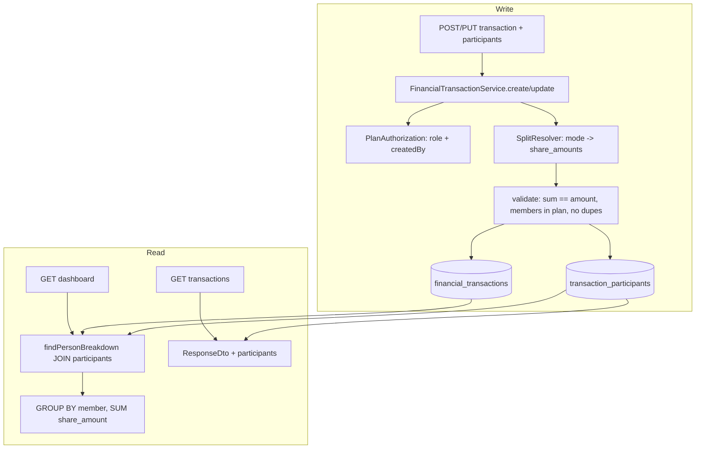

# Expense Splitting & Attribution — Design

**Spec**: `./spec.md`
**Research/decisões**: `../shared-plans/research-shared-expenses.md`
**Status**: Draft (aguardando aprovação antes de Tasks)

---

## Architecture Overview

Uma tabela de junção `transaction_participants` passa a carregar a **titularidade/rateio** de cada transação, enquanto `financial_transactions.created_by` continua sendo **só autoria** (imutável). O `amount` da transação continua sendo o total; a soma dos `share_amount` das participações é sempre igual a ele. O breakdown por pessoa (PLAN-08) passa a somar cotas por participante. Nada de ledger de dívida.



**Princípio-chave**: a participação é o **único** mecanismo de atribuição. Despesa pessoal = 1 participação de 100%. Não há caminho alternativo (`attributed_to`) — evita dois caminhos e a dupla migração.

---

## Code Reuse Analysis

### Componentes existentes a alavancar (verificados)

| Componente | Local | Como usar |
| --- | --- | --- |
| `PlanAuthorization` | `security/PlanAuthorization.java:14` | Adicionar `requireCanAttributeToOthers(role)` (OWNER/EDITOR); reusar `requireCanCreateTransaction`/`requireCanModifyTransaction` inalterados |
| `PlanContext` | `security/PlanContext.java` | `ctx.getPlan()`, `ctx.getUser()`, `ctx.getRole()` — fonte de plano/ator/role |
| `FinancialTransactionService.create/update/createSeries` | `services/FinancialTransactionService.java:96,124,158` | Estender para resolver+persistir participações; extrair helper `applyParticipants(txn, dto, ctx)` |
| `RecurringTransactionGenerator.baseTransaction` | `services/RecurringTransactionGenerator.java:69` | Carimbar participações resolvidas em cada ocorrência |
| `findPersonBreakdown` + `buildPersonBreakdown` | `repositories/FinancialTransactionRepository.java:60`, `services/DashboardService.java:103` | Repontar JPQL para JOIN em participações; DTO/loop quase idêntico |
| `PersonBreakdownDto` | `dtos/response/PersonBreakdownDto.java` | Inalterado (a chave passa a ser o participante em vez do autor) |
| `PlanMembershipRepository` | `repositories/` | Validar que cada `member_user_id` é membro (`existsByPlanAndUser` / `findByPlanAndUser`) |
| Membership/roles | `models/PlanRole.java` (OWNER/EDITOR/CONTRIBUTOR/VIEWER) | Regras de SPLIT-03 |
| **FE** `PlanMembersList` (avatar/iniciais, `getFirstAndLastInitials`) | `features/plans/...`, `utils/string/formatters.ts:36` | Reusar para exibir titular na tabela (SPLIT-07) |
| **FE** `TransactionFormDrawer` + `CategoryCombobox` | `features/home/components/transactions/` | Padrão para o seletor de participantes (SPLIT-08) |
| **FE** service-hook + `buildMutationOptions` | `src/api/services/useFinancialTransactionService.ts` | Estender payload; invalidação já existente |

### Pontos de integração

| Sistema | Integração |
| --- | --- |
| Flyway | Nova migration `V5__add_transaction_participants.sql` (`ddl-auto=validate` em vigor; Flyway dono do schema) |
| `financial_transactions` | Nova coluna `split_mode`; nova FK reversa via `transaction_participants.transaction_id` |
| Dashboard totais | `sumByPlanAndTypeAndDateRange` (soma `amount`) inalterado; consistente com soma das cotas |
| Category breakdown | Inalterado — categoria é por-transação, ortogonal ao rateio |
| CSV import | Cada linha importada gera participação única 100% para `ctx.getUser()` (usa o mesmo default) |

---

## Data Models

### Migration `V5__add_transaction_participants.sql`

```sql
ALTER TABLE financial_transactions
    ADD COLUMN split_mode VARCHAR(16) NOT NULL DEFAULT 'EQUAL';

CREATE TABLE transaction_participants (
    id             BIGINT GENERATED BY DEFAULT AS IDENTITY PRIMARY KEY,
    transaction_id BIGINT        NOT NULL REFERENCES financial_transactions(id) ON DELETE CASCADE,
    member_user_id BIGINT        NOT NULL REFERENCES users(id),
    share_amount   NUMERIC(19,2) NOT NULL,
    CONSTRAINT uq_txn_participant UNIQUE (transaction_id, member_user_id)
);
CREATE INDEX idx_txn_participants_txn    ON transaction_participants(transaction_id);
CREATE INDEX idx_txn_participants_member ON transaction_participants(member_user_id);

-- Backfill: cada transação existente vira participação única de 100% para o autor
INSERT INTO transaction_participants (transaction_id, member_user_id, share_amount)
SELECT id, created_by, amount FROM financial_transactions;
```

> Nota de escala: `NUMERIC(19,2)` espelha o uso de `BigDecimal` de 2 casas já praticado (`CategoryBreakdownDto` divide com scale 2). Sem `share_amount` negativo — sinal vem do `type` da transação (como `amount`).

### Entidade `TransactionParticipant` (nova)

```java
@Entity @Table(name = "transaction_participants")
class TransactionParticipant {
    Long id;
    @ManyToOne(optional=false) @JoinColumn(name="transaction_id") FinancialTransaction transaction;
    @ManyToOne(optional=false) @JoinColumn(name="member_user_id")  User member;
    BigDecimal shareAmount; // NOT NULL
}
```

### `FinancialTransaction` (alteração)

```java
// nova coleção — cascade + orphanRemoval para substituição atômica no update
@OneToMany(mappedBy="transaction", cascade=ALL, orphanRemoval=true)
List<TransactionParticipant> participants = new ArrayList<>();

@Enumerated(STRING) SplitMode splitMode; // EQUAL | EXACT | PERCENT  (default EQUAL)
// created_by, plan, amount, type... INALTERADOS
```

`enum SplitMode { EQUAL, EXACT, PERCENT }` (novo). MVP resolve só EQUAL/EXACT; PERCENT aceito no enum/coluna mas rejeitado na resolução até implementado.

### FE types (`src/api/dtos/financialTransaction.ts`)

```ts
type ParticipantShare = { memberId: number; memberName: string; shareAmount: number };
type FinancialTransaction = {
  /* ...existentes... */
  createdBy?: { id: number; name: string };   // autoria (mantido)
  splitMode: "EQUAL" | "EXACT" | "PERCENT";
  participants: ParticipantShare[];
};
// create/update body:
type ParticipantInput = { memberId: number; shareAmount?: number }; // shareAmount só p/ EXACT
// body ganha: splitMode?, participants?: ParticipantInput[]
```

---

## Components

### SplitResolver (novo — lógica pura)
- **Purpose**: dado `amount`, `splitMode` e a entrada de participantes, produzir `List<{member, shareAmount}>` com soma **exata** = `amount`.
- **Location**: `services/SplitResolver.java` (ou método package-private no service; preferir classe testável, espelhando `PlanAuthorization` como lógica pura).
- **Interfaces**:
  - `List<ResolvedShare> resolve(BigDecimal amount, SplitMode mode, List<ParticipantInput> inputs)`
    - `EQUAL`: `base = amount.divideToIntegralValue(n scaled)`; distribui o resíduo de centavos aos primeiros participantes (determinístico) → soma exata.
    - `EXACT`: usa `shareAmount` de cada input; valida `sum == amount` senão `IllegalArgumentException` (→400).
    - `PERCENT`: **não** implementado no MVP → lança erro claro "PERCENT not yet supported".
- **Dependencies**: nenhuma (pura). **Reuses**: idioma `BigDecimal`/`RoundingMode.HALF_UP` já usado no projeto.

### PlanAuthorization (estender)
- **Nova interface**: `void requireCanAttributeToOthers(PlanRole role)` — permite OWNER/EDITOR; lança `InsufficientPlanRoleException` para CONTRIBUTOR/VIEWER.
- **Uso**: chamada no service **somente quando** as participações resolvidas envolvem alguém ≠ `ctx.getUser()` **ou** são >1 (i.e., não é o caso "100% pra si"). Assim CONTRIBUTOR mantém o fluxo atual sem fricção.
- **Reuses**: mesmo estilo throw-on-deny dos `requireXxx` existentes (`PlanAuthorization.java:17-58`).

### FinancialTransactionService (estender create/update/createSeries)
- **Novo helper**: `private void applyParticipants(FinancialTransaction txn, FinancialTransactionRequestDto dto, PlanContext ctx)`:
  1. Se `dto.participants` vazio/nulo → `[{ctx.getUser(), amount}]`, `splitMode=EQUAL`.
  2. Senão → validar membership de cada `memberId` (`PlanMembershipRepository`), rejeitar duplicados; `SplitResolver.resolve(...)`.
  3. Se resultado ≠ "100% para `ctx.getUser()`" → `requireCanAttributeToOthers(ctx.getRole())`.
  4. `txn.setSplitMode(...)`; substituir `txn.getParticipants()` (clear+add → orphanRemoval cuida do delete no update).
- **create** (`:96`): após montar a txn, chamar `applyParticipants` antes do `save`.
- **update** (`:124`): após `requireCanModifyTransaction`, chamar `applyParticipants` (substitui as antigas).
- **createSeries** (`:158`): resolver participações uma vez e passar o template ao gerador.
- **Reuses**: `dateUtils`, `financialTransactionCategoryService`, `planAuthorization` já injetados; adicionar `SplitResolver` + `PlanMembershipRepository`.

### RecurringTransactionGenerator (estender)
- `baseTransaction` (`:69`) passa a receber o **template resolvido de participações** e cria uma `TransactionParticipant` por membro em cada ocorrência (mesmo `share_amount`, pois o `amount` por ocorrência é constante).
- **Reuses**: estrutura de loop atual inalterada.

### PLAN-08 repoint — `findPersonBreakdown` + `buildPersonBreakdown`
- **Novo JPQL** (`FinancialTransactionRepository.java:60`):
```java
@Query("SELECT tp.member.id, tp.member.name, ft.type, COALESCE(SUM(tp.shareAmount), 0) " +
       "FROM FinancialTransaction ft JOIN ft.participants tp " +
       "WHERE ft.plan = :plan " +
       "AND ft.startDate >= :startDate AND ft.startDate <= :endDate " +
       "GROUP BY tp.member.id, tp.member.name, ft.type")
List<Object[]> findPersonBreakdown(Plan plan, LocalDate startDate, LocalDate endDate);
```
- `buildPersonBreakdown` (`DashboardService.java:103`): **inalterado** — mesmas posições `(id, name, type, sum)`; só a semântica muda (participante em vez de autor).
- **Consistência**: `sumByPlanAndTypeAndDateRange` soma `ft.amount`; a soma das cotas por participante = `amount` por transação ⇒ totais batem.

### Response DTO (`FinancialTransactionResponseDto`)
- Adicionar `List<ParticipantDto> participants` (`{id, name, shareAmount}`) e `SplitMode splitMode`, construídos de `transaction.getParticipants()`. `CreatedByDto` mantido (`:41`).

### FE — SPLIT-07 (tabela) e SPLIT-08 (form)
- **SPLIT-07**: coluna "Titular" em `transactionColumns.tsx`: 1 participante → avatar+nome (`getFirstAndLastInitials`); N → badge "N pessoas" com tooltip/lista. Esconder a coluna quando `plan.members.length === 1` (dado já disponível via `usePlanContext`/`useGetPlans`).
- **SPLIT-08**: em `TransactionFormDrawer`, seção de participantes visível só para OWNER/EDITOR (`myRole` do plano ativo): multiselect de membros + toggle `EQUAL`/`EXACT` + inputs de valor (EXACT). Validação zod client-side de soma = total. Seguir a skill `form-creation` (schema module-scope, `Controller` para o multiselect controlado).

---

## Error Handling Strategy

| Cenário | Tratamento | Usuário vê |
| --- | --- | --- |
| `SUM(share_amount) != amount` (EXACT) | `IllegalArgumentException` → `GlobalExceptionHandler` 400 | "As cotas devem somar o valor total." |
| `member_user_id` não é membro do plano | 400/403 (via validação + handler) | "Participante não é membro do plano." |
| Membro duplicado na transação | `IllegalArgumentException` 400 (e `uq_txn_participant` como rede) | "Participante repetido." |
| CONTRIBUTOR tenta ratear/atribuir a outro | `requireCanAttributeToOthers` → `InsufficientPlanRoleException` 403 | "Você só pode lançar despesas suas." |
| `split_mode = PERCENT` no MVP | `IllegalArgumentException` 400 | "Divisão por percentual ainda não disponível." |
| Participações vazias no payload | Default 100% self (não é erro) | — |

---

## Tech Decisions (não óbvias)

| Decisão | Escolha | Racional |
| --- | --- | --- |
| Titularidade em junção vs. coluna `attributed_to` | Junção `transaction_participants` | Subsume DEC-1; evita dois mecanismos e a dupla migração (research §3) |
| Guardar valor resolvido vs. % cru | `share_amount` resolvido + `split_mode` | Breakdown = SUM trivial; % vira modo de entrada (0 migração futura) — ver research §3/§5.2 |
| Gate de rateio | `requireCanAttributeToOthers` só quando envolve terceiros | CONTRIBUTOR mantém fluxo atual sem fricção; regra da decisão do usuário |
| Participante referencia `User` (não `PlanMembership`) | FK `users(id)` | Consistente com `created_by`; atribuição histórica sobrevive à remoção do membro (spec SPLIT-05 AC3) |
| `share_amount` para CREDIT também | Sim, uniforme | Sem regra especial de receita (spec Out of Scope) |
| Backfill | 1 participação 100% p/ `created_by` | Determinístico, sem perda, retrocompatível |

---

## Concerns / Riscos (ver review BE-7)

- **Sem infra de teste de integração** no projeto → os guardas novos (invariante de soma, membership, gate de role) serão verificados por E2E manual, como os guardas de Shared Plans. Registrar como risco residual; o `SplitResolver` puro **deve** ter testes unitários (espelha `PlanAuthorization`, que é o único com testes hoje).
- **Migração destrutiva? Não** — V5 é aditiva (nova tabela/coluna + backfill), reversível conceitualmente. Testar em cópia do dev DB antes.
- **Performance PLAN-08**: o JOIN em participações multiplica linhas por participante; em planos pequenos é irrelevante. Índice `idx_txn_participants_txn` cobre o join.

---

## Próximo passo

Aprovar este design → gerar `tasks.md` (quebra atômica com dependências). Ordem natural: SPLIT-01 (migration+entidade) → SPLIT-02/03 (service+resolver+authz) → SPLIT-04 (recorrentes) → SPLIT-05 (PLAN-08) → SPLIT-06 (DTOs/tipos) → SPLIT-07 (tabela) → SPLIT-08 (form, P2).
