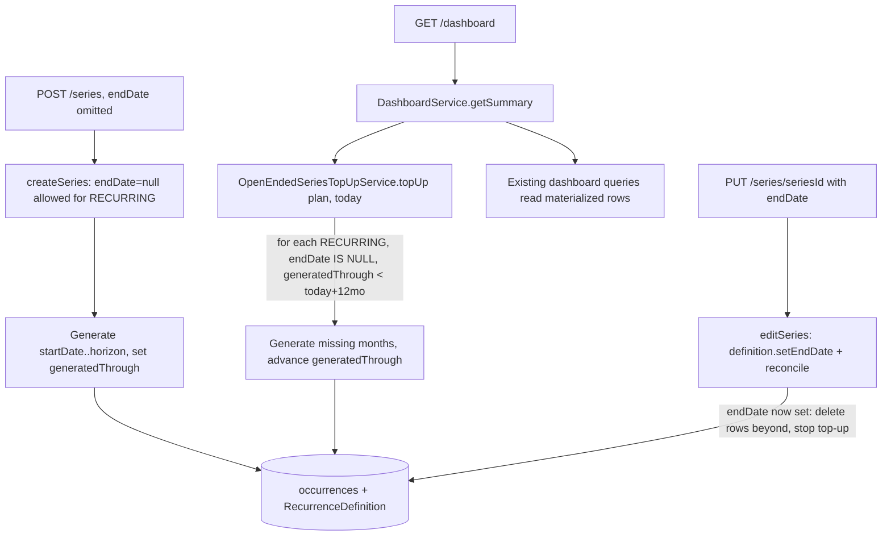

# Recurrence Model v2 Design

**Spec:** `.specs/features/recurrence-model-v2/spec.md`
**Context:** `.specs/features/recurrence-model-v2/context.md` (D1 on-read, D2 H=12, D3 P3 in-scope)
**Status:** Approved — Tasks broken down (`tasks.md`), awaiting Execute

---

## Architecture Overview

Two independent workstreams share one feature:

**Part 1 (retire `frequency`)** is a mechanical deletion across the stack + a `DROP COLUMN` migration. No
architecture — it removes a vestigial field. Sequenced first because Part 2 rewrites overlapping code
(generator, SeriesRegenerator, createSeries) and this clears the noise.

**Part 2 (open-ended recurrence)** reuses the existing materialize-real-rows model. An open-ended series
is simply a `RecurrenceDefinition` with `mode = RECURRING` and `endDate = null`. The `generatedThrough`
watermark (already on the entity, currently always-null) becomes the source of truth for "how far ahead
we've materialized." A lazy, on-read top-up refills the rolling window.



**Key invariant:** the top-up query targets **only** `mode = RECURRING AND endDate IS NULL`. Every
existing (bounded) series has `endDate NOT NULL`, so it is never touched and needs **no backfill** of
`generatedThrough`.

---

## Code Reuse Analysis

### Existing Components to Leverage

| Component | Location | How to Use |
| --------- | -------- | ---------- |
| `FinancialTransactionService.createSeries` | `services/FinancialTransactionService.java:331` | Relax the RECURRING-requires-endDate check (347-349); set `generatedThrough` after generation. |
| `FinancialTransactionService.editSeries` | `:493` | P3 reuse: `definition.setEndDate(...)` (already at 564) + reconcile already delete/extend. Add: set/clear `generatedThrough` when endDate toggles null↔set. |
| `RecurringTransactionGenerator` | `services/RecurringTransactionGenerator.java` | Effective-end = `endDate != null ? endDate : horizonCap` in the RECURRING loop; add a definition-driven forward-window generator for top-up. `MAX_OCCURRENCES=120` stays as per-pass backstop. |
| `SeriesRegenerator` | `services/SeriesRegenerator.java` | Already stamps occurrences from a `RecurrenceDefinition` (`stampOccurrence`, `buildRecurringTargets`). Reuse the stamping for top-up; drop the `frequency` slot from its `TargetOccurrence` record. |
| `RecurrenceDefinition` (V8) | `models/RecurrenceDefinition.java` | No schema change — `endDate` nullable + `generatedThrough` already exist. Its `participants` children supply the shares for top-up stamping. |
| `RecurrenceDefinitionRepository` | `repositories/RecurrenceDefinitionRepository.java` | Add a `findOpenEndedDue(plan, horizonCap)` query with a pessimistic write lock (idempotency). |
| `DashboardService.getSummary` | `services/DashboardService.java:39` (`@Transactional(readOnly=true)`) | The on-read hook site: call `topUpService.topUp(plan, today)` first. Top-up runs in its own `REQUIRES_NEW` read-write tx so `getSummary` stays `readOnly`. |
| `SeriesEditIT` / `RecurringTransactionGeneratorTest` / `SeriesRegeneratorTest` / `DashboardPartitionIT` | `test/.../services/` | Regression surface; extend for open-ended + assert Part-1 removal caused no behavior change. |

### Integration Points

| System | Integration Method |
| ------ | ------------------ |
| Flyway | New `V9__drop_frequency_column.sql` (`DROP COLUMN frequency`). Next number is V9 (V8 is highest). |
| Dashboard read | `DashboardService.getSummary` calls the top-up service before its read queries. |
| Series edit | Bounding an open-ended series flows through the existing `editSeries` → `SeriesRegenerator.reconcile` path — no new endpoint. |

---

## Components

### OpenEndedSeriesTopUpService (new)

- **Purpose**: Lazily materialize missing future occurrences for open-ended RECURRING series up to the
  rolling horizon, idempotently.
- **Location**: `services/OpenEndedSeriesTopUpService.java`
- **Interfaces**:
  - `@Transactional(propagation = REQUIRES_NEW) void topUp(Plan plan, LocalDate today)` — for each due
    definition (locked), generate months in `(generatedThrough, today+H]`, `saveAll`, advance
    `generatedThrough` to the last generated occurrence's date. No-op when nothing is due.
- **Dependencies**: `RecurrenceDefinitionRepository` (locked due-query), `FinancialTransactionRepository`
  (saveAll), the definition-driven window generator (in `RecurringTransactionGenerator` or
  `SeriesRegenerator`), a `Clock`/time source for `today`.
- **Reuses**: definition→occurrence stamping (participants from `def.getParticipants()`), `MAX_OCCURRENCES`
  cap per pass.
- **Idempotency**: the due-query fetches definitions with `@Lock(PESSIMISTIC_WRITE)`; a concurrent top-up
  serializes on the definition row and sees the advanced watermark → no duplicate months. (Single-instance
  app; lock is cheap insurance.)

### RecurringTransactionGenerator (modify)

- **Purpose**: Add open-ended awareness.
- **Changes**:
  - RECURRING loop uses `effectiveEnd = dto.getEndDate() != null ? dto.getEndDate() : horizonCap` where
    `horizonCap = today.plusMonths(H)`.
  - Remove the two `setFrequency(...)` calls (lines 51, 71).
  - Add `List<FinancialTransaction> generateForwardWindow(RecurrenceDefinition def, LocalDate afterExclusive, LocalDate throughInclusive, List<ResolvedParticipant> shares)` for top-up (months strictly after the watermark). Per-pass `ensureWithinCap`.
- **Reuses**: existing `baseTransaction` stamping shape.

### FinancialTransactionService (modify)

- **createSeries** (`:331`): drop the "End date is required for recurring series" throw (347-349); after
  generation, compute and set `definition.generatedThrough = last occurrence's startDate`. Keep INSTALLMENT
  requires-parcels + RECURRING requires-interval.
- **editSeries** (`:493`): when the effective endDate transitions **set → null** (becoming open-ended),
  extend to horizon and set `generatedThrough`; when **null → set** (P3 bounding), the existing reconcile
  already deletes rows beyond endDate — additionally set `generatedThrough = endDate` so top-up stops.
  Series edit is **full-replace** (consistent with the transaction PUT contract): a null `endDate` on a
  RECURRING edit means open-ended, not "no change."
- Remove `setFrequency(dto.getFrequency())` from single-tx create (168) and update (198).

### SeriesRegenerator (modify)

- Drop `frequency` from the `TargetOccurrence` record (line 41) and the `tx.setFrequency(slot.frequency())`
  stamp (line 122). No behavior change (field was cosmetic).

### DashboardService (modify)

- **getSummary** (`:39`): inject `OpenEndedSeriesTopUpService`; call `topUp(ctx.getPlan(), today)` as the
  first statement. `getSummary` stays `readOnly=true`; the top-up's `REQUIRES_NEW` tx does the writes.

### DTOs (modify)

- `FinancialTransactionRequestDto`: remove `frequency` field + getter (28, 59-61).
- `FinancialTransactionResponseDto`: remove `frequency` field, constructor assignment, getter (21, 39, 175-176).
- `FinancialTransaction` entity: remove `frequency` field + getter/setter (40, 124-129).
- Frontend `financialTransaction.ts`: remove dead `frequency?: string` (line 27).

### Frontend series form (modify — RMV2-08)

- **Purpose**: allow "no end date" in RECURRING mode + show the series is ongoing.
- **Location**: the series create form (feature `transactions`/series drawer — locate the recurring-mode
  end-date field + its zod schema).
- **Changes**: make endDate optional when mode = RECURRING (zod refine); render an "ongoing / no end date"
  affordance (empty field is valid, with helper text). Installments unchanged (bounded by N).

---

## Data Models

No new tables or columns. Semantics assigned to existing fields:

```
RecurrenceDefinition (existing V8 table):
  endDate: LocalDate | null    // null + mode=RECURRING  => open-ended
  generatedThrough: LocalDate  // date of the last materialized occurrence (NEW meaning; was always-null)
                               //   bounded series: ~= endDate
                               //   open-ended:     ~= today + H (rolls forward on top-up)
```

**Migration:** `V9__drop_frequency_column.sql` → `ALTER TABLE financial_transactions DROP COLUMN frequency;`
(confirm exact table/column name from the entity `@Table`/`@Column` during Execute). `ddl-auto=validate`
must pass after the entity field is removed.

**No `generatedThrough` backfill:** existing series have `endDate NOT NULL` and are excluded from the
top-up query, so a null watermark on them is inert.

---

## Error Handling Strategy

| Error Scenario | Handling | User Impact |
| -------------- | -------- | ----------- |
| RECURRING create with no endDate | Accepted (open-ended) | Series created, 12mo look-ahead materialized |
| INSTALLMENT create with no parcelsNumber | Existing `IllegalArgumentException` → 400 | Unchanged |
| Open-ended series whose start is so old that start→horizon > 120 months | Existing `MAX_OCCURRENCES` guard → 400 on create | Same as bounded today; user sets a later start |
| Concurrent top-ups on one definition | Pessimistic write lock serializes them | No duplicate occurrences |
| Top-up when nothing due (`generatedThrough >= horizon`) | No-op | No side effect on the read |

---

## Tech Decisions (non-obvious)

| Decision | Choice | Rationale |
| -------- | ------ | --------- |
| Top-up trigger | On dashboard read only (v1) | Dashboard is the look-ahead surface; D1 = on-read. Transactions-list hook is a trivial future add if the table proves stale. |
| `generatedThrough` meaning | Date of last materialized occurrence | Makes "next month after watermark" top-up trivial + idempotent; uniform across bounded/open-ended. |
| Open-ended range on create | `startDate → today+H` (may include past months if start is past) | Mirrors existing bounded semantics (bounded with a past start also generates past months); user controls start; cap is the backstop. |
| `today` source | Injected `Clock` (not `LocalDate.now()`) | Makes RMV2-06 (rolling top-up) unit-testable by advancing simulated time. |
| Idempotency | Pessimistic write lock on the due-query | Correct-by-design; cheap on a single-instance app; avoids a new unique constraint + data-migration risk. |
| Series edit endDate semantics | Full-replace (null = open-ended) | Consistent with the transaction PUT full-replace contract; makes bound↔unbound symmetric through one path. |

---

## Concerns / Notes

- **Unbounded lifetime growth**: an open-ended series accrues ~12 rows/year forever. Not a v1 problem
  (10yr = 120 rows), but note a future "prune old occurrences / archive" idea in Deferred Ideas.
- **CONCERNS.md**: series generation + dashboard now have real IT coverage (test-foundation). The design
  extends those suites rather than adding untested surface.
- **mermaid-studio** skill not detected — used an inline mermaid block. (Recommend installing it for
  richer rendered diagrams; shown once.)
