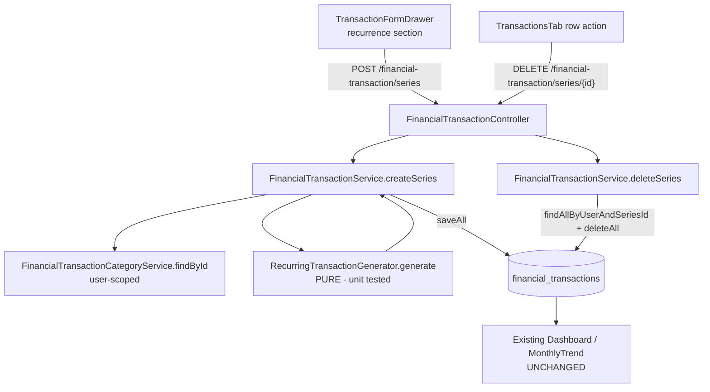

# Recurring & Installment Transactions Design

**Spec**: `.specs/features/recurring-transactions/spec.md`
**Status**: Draft

---

## Architecture Overview

A **series** is a set of concrete `FinancialTransaction` rows that share a generated `seriesId` (UUID string). The user submits one _series request_; the backend expands it deterministically into N occurrences and persists them with a single `saveAll`. Nothing else changes: because occurrences are ordinary transactions with real `startDate`s, the existing dashboard, monthly-trend, filtering, and per-row edit/delete all work on them for free.

Generation logic lives in a **pure** `RecurringTransactionGenerator` component (no Spring/JPA/DB dependencies) so it is unit-testable in isolation — this is the only piece with branching logic (installment vs. recurring, occurrence count, monthly stepping, caps) and the main correctness risk ("did it make the right number of transactions?").



> Diagrams here are inline Mermaid. If richer diagram rendering is wanted later, the `mermaid-studio` skill can be installed — noting once, not required.

---

## Code Reuse Analysis

### Existing Components to Leverage

| Component | Location | How to Use |
| --- | --- | --- |
| `FinancialTransaction` entity | `models/FinancialTransaction.java` | Add one nullable `seriesId` field; reuse all existing fields for occurrences |
| `FinancialTransactionService.create` pattern | `services/FinancialTransactionService.java` | Mirror its category lookup + type-match guard + save; add `createSeries`/`deleteSeries` |
| `findById(id, user)` ownership pattern | same service | Reuse the "fetch then verify `user.getId()`" pattern for series deletion (404 if none) |
| `repository.saveAll(...)` | already used by CSV import | Batch-persist all occurrences in one call |
| `DateUtils.checkIfStartDateIsBeforeEndDate` | `utils/DateUtils.java` | Reuse for recurring start≤end validation |
| `GlobalExceptionHandler` (`IllegalArgumentException → 400`) | `exceptions/` | Reuse for series input validation errors (cap exceeded, mode/field mismatch) |
| `FinancialTransactionResponseDto(entity)` constructor | `dtos/response/` | Reuse to map each occurrence; add `seriesId` to it |
| Frontend `TransactionFormDrawer` (Sheet + RHF + zod) | `features/home/components/transactions/TransactionFormDrawer.tsx` | Extend with a conditional recurrence section (create mode only) |
| Frontend service pattern (`buildMutationOptions`, `["financialTransactions"]` key) | `api/services/useFinancialTransactionService.ts` | Add series create/delete hooks mirroring existing ones |
| `useConfirm` destructive dialog | `components/dialog/useConfirmDialog` | Reuse for "delete whole series" confirmation |
| `DatePicker`, `Field*`, `Input`, `Button`, `Badge` | `components/input/*`, `components/badge/Badge` | Reuse for new fields + series badge |

### Integration Points

| System | Integration Method |
| --- | --- |
| Existing dashboard / monthly-trend | None needed — reads generated rows via the current queries, no changes |
| Existing single-create/edit/delete | Untouched — series endpoints are additive; per-occurrence delete still works |
| CSV import dedup (`externalId`) | Generated rows leave `externalId = null` → cannot collide with imported ids |
| Schema | New `series_id` column created by Hibernate `ddl-auto=update` (no migration tool yet — see CONCERNS.md) |

---

## Components

### RecurringTransactionGenerator (new, backend)

- **Purpose**: Pure expansion of a series request into occurrence entities — the only branching logic, isolated for testing.
- **Location**: `services/RecurringTransactionGenerator.java` (`@Component`, no repository/DB deps).
- **Interfaces**:
  - `List<FinancialTransaction> generate(FinancialTransactionSeriesRequestDto dto, User user, FinancialTransactionCategory category, String seriesId)` — builds, does not save.
- **Behavior**:
  - `INSTALLMENT`: let `k = dto.currentParcel` (defaults to `1` when null), `N = dto.parcelsNumber`. For `p` in `k..N`, occurrence at `startDate.plusMonths(p - k)` (so the current parcel `k` lands on `startDate`), `amount = dto.amount` (per-parcel), description = `dto.description + " (" + p + "/" + N + ")"`, `parcelsNumber` set to `N`, `frequency = null`, `endDate = null`, `seriesId` shared. Generated count = `N - k + 1`. When `k = 1` this is identical to the original `1..N` behaviour.
  - `RECURRING` (interval MONTHLY): occurrences at `startDate`, `startDate.plusMonths(1)`, … while `≤ endDate`; `amount = dto.amount`; `frequency = "MONTHLY"`; `parcelsNumber = null`; `endDate = null` per row.
  - Enforces `MAX_OCCURRENCES` (120) on the **generated** count (`N - k + 1`) — throws `IllegalArgumentException` if exceeded.
  - Month overflow (e.g. day 31 → shorter month) is handled by `LocalDate.plusMonths` (clamps to last valid day).
- **Dependencies**: none (pure).
- **Reuses**: nothing at runtime; mirrors field-setting done in `service.create`.

### FinancialTransactionService (extend, backend)

- **Purpose**: Orchestrate series create/delete with ownership + validation.
- **Location**: `services/FinancialTransactionService.java`.
- **Interfaces**:
  - `@Transactional List<FinancialTransaction> createSeries(FinancialTransactionSeriesRequestDto dto, User user)` — validate (mode/fields, start≤end via DateUtils, and for INSTALLMENT: `currentParcel` — when present — is within `1..parcelsNumber`), resolve category (reuse `categoryService.findById(id, user)` + type-match guard), `generate(...)`, `repository.saveAll(...)`.
  - `@Transactional void deleteSeries(String seriesId, User user)` — `repository.findAllByUserAndSeriesId(user, seriesId)`; if empty throw `FinancialTransactionNotFoundException`-style 404; else `repository.deleteAll(list)`.
- **Dependencies**: `RecurringTransactionGenerator`, `FinancialTransactionCategoryService`, `FinancialTransactionRepository`, `DateUtils`, `java.util.UUID` for `seriesId`.
- **Reuses**: existing category lookup + type guard + `findById` ownership pattern.

### FinancialTransactionRepository (extend, backend)

- **Add**: `List<FinancialTransaction> findAllByUserAndSeriesId(User user, String seriesId)` (derived query).
- **Reuses**: inherited `saveAll` / `deleteAll`.

### FinancialTransactionController (extend, backend)

- **Add** (same auth pattern — `@AuthenticationPrincipal UserDetails` → `userService.findByEmail`):
  - `POST /series` → `@RequestBody @Valid FinancialTransactionSeriesRequestDto` → `201` with `FinancialTransactionSeriesResponseDto`.
  - `DELETE /series/{seriesId}` → `204 No Content`.
- **Reuses**: existing controller wiring; inline path literals (matches existing `"/import"` style).

### TransactionFormDrawer (extend, frontend)

- **Purpose**: Let the user opt a new transaction into a series (create mode only).
- **Location**: `features/home/components/transactions/TransactionFormDrawer.tsx`.
- **Behavior**: Add a "Repetir / Parcelar" toggle. When on (and `mode === "create"`), show a mode segmented control (Parcelado | Recorrente); Parcelado → `parcelsNumber` (total N) input + an optional **current-parcel** input (`currentParcel`, default 1, `1..N`) with a read-only derived line "última: `N/N` — `<month>`" (`month = startDate + (N − currentParcel)`); Recorrente → `endDate` `DatePicker` (interval fixed MONTHLY in v1). The date field is labelled as the current parcel's month in Parcelado mode. `onSubmit` branches: if series → `createSeries({ body })` (omit `currentParcel` when 1); else existing `createFinancialTransaction`. Edit/duplicate modes hide the section (editing a series is P3/out of scope).
- **Reuses**: existing Sheet/RHF/zod structure, `DatePicker`, `Field*`, `TransactionTypeToggle`, `maskCurrency`.

### Series affordances in the table (extend, frontend)

- **`transactionColumns.tsx`**: show a small `Badge` (e.g. `"3/12"` for installments or a repeat icon for recurring) when `transaction.seriesId` is present.
- **`TransactionsTab.tsx`**: add a row action / confirm path "Excluir série" shown only for series rows → `useConfirm` (destructive) → `deleteSeries(seriesId)`. Existing single-delete stays for one-off removal of a single occurrence (RECUR-08).

---

## Data Models

### Backend — `FinancialTransaction` (added field)

```java
// new nullable column; occurrences of one series share the value
@Column(name = "series_id")
private String seriesId;   // UUID string, null for standalone transactions
// + index (user_id, series_id) for series lookup/delete
```

### Backend — new enums

```java
enum RecurrenceMode { INSTALLMENT, RECURRING }
enum RecurrenceInterval { MONTHLY }   // extensible; v1 = monthly only
```

### Backend — `FinancialTransactionSeriesRequestDto`

```
FinancialTransactionType type      @NotNull
BigDecimal                amount    @NotNull @Positive   // per-occurrence amount
String                    description @NotBlank
Long                      categoryId  (optional, user-scoped lookup)
RecurrenceMode            mode       @NotNull
LocalDate                 startDate  @NotNull   // month of the FIRST GENERATED parcel (the current parcel k)
Integer                   parcelsNumber   // total count N; required when mode=INSTALLMENT, @Min(2) @Max(120)
Integer                   currentParcel   // k; optional (default 1) when mode=INSTALLMENT, @Min(1); service checks k ≤ N
RecurrenceInterval        interval        // required when mode=RECURRING (v1: MONTHLY)
LocalDate                 endDate         // required when mode=RECURRING, must be ≥ startDate
```
Cross-field validation (mode-conditional required fields, start≤end, cap) enforced in the service via `IllegalArgumentException` (→ 400), keeping DTO annotations simple and consistent with the existing style.

### Backend — `FinancialTransactionSeriesResponseDto`

```
String seriesId
int    count
List<FinancialTransactionResponseDto> occurrences
```
Plus: add `String seriesId` to the existing `FinancialTransactionResponseDto`.

### Frontend — DTO additions (`api/dtos/financialTransaction.ts`)

```ts
export type RecurrenceMode = "INSTALLMENT" | "RECURRING";
export type RecurrenceInterval = "MONTHLY";

export type CreateFinancialTransactionSeriesRequest = {
  body: {
    type: FinancialTransactionType;
    amount: number;
    description: string;
    categoryId?: number;
    mode: RecurrenceMode;
    startDate: string;              // yyyy-MM-dd — month of the current parcel (first generated)
    parcelsNumber?: number;         // total N, when INSTALLMENT
    currentParcel?: number;         // k, when INSTALLMENT (default 1)
    interval?: RecurrenceInterval;  // when RECURRING
    endDate?: string;               // when RECURRING
  };
};

export type FinancialTransactionSeriesResponse = {
  seriesId: string;
  count: number;
  occurrences: FinancialTransaction[];
};

// add to FinancialTransaction (read type):
//   seriesId?: string;
```

---

## Error Handling Strategy

| Error Scenario | Handling | User Impact |
| --- | --- | --- |
| Missing start/end/parcels for the chosen mode | Zod schema blocks submit (frontend) + service `IllegalArgumentException` → 400 (backend) | Inline field error; cannot submit unbounded series |
| `endDate` before `startDate` | `DateUtils` check → `IllegalArgumentException` → 400 | Validation toast/field error |
| Occurrence count exceeds cap (120) | Generator throws `IllegalArgumentException` → 400 (checked on generated count `N − k + 1`) | Clear "range too large" message; nothing inserted |
| `currentParcel` out of range (`< 1` or `> parcelsNumber`) | Zod blocks submit (frontend) + service `IllegalArgumentException` → 400 (backend) | Inline field error; cannot register an impossible parcel |
| `categoryId` not owned / type mismatch | Reused category lookup 404 / type-guard 400 | Existing behavior, unchanged |
| Delete series id with no rows for user | Service throws not-found → 404 | "Series not found" |
| All series ops for another user's data | Ownership checks scope every query to `user.getId()` | Cannot touch others' data |

---

## Tech Decisions (non-obvious)

| Decision | Choice | Rationale |
| --- | --- | --- |
| Series representation | Shared `seriesId` column, no parent entity | Simplest; occurrences stay ordinary transactions → dashboard/edit/delete work unchanged |
| Amount semantics | `amount` = per-occurrence (per parcel / per period) | Matches how the user thinks ("R$300 in 12x") and the existing single-amount form |
| Bounded only | Require parcels count or end date; cap 120 | Avoids infinite recurrence for v1 (spec); rolling-window infinite is deferred (STATE.md) |
| Cross-field validation location | In service (`IllegalArgumentException`), not bean-validation groups | Consistent with existing validation style; avoids validation-group ceremony |
| Generation as pure component | `RecurringTransactionGenerator` POJO | Unit-testable **without a DB** (backend's `@SpringBootTest` needs Postgres — see CONCERNS); plants the first real backend unit test |
| Endpoint shape | Dedicated `/series` + `/series/{id}` | Keeps the proven single-create/delete paths untouched |
| Occurrence `endDate` | `null` per row (range implied by seriesId min/max) | A materialized occurrence is a point in time, not a range |
| In-progress installment input | `currentParcel` k (default 1) + total N; generate `k..N` inclusive; `startDate` = month of k | Matches how users think ("I'm on 5 of 12"); k=1 is backward-compatible; user picks k past already-imported parcels to avoid double-counting (no auto-dedup against CSV) |
| Implied installment end | Derived + shown read-only, not a separate input | An explicit end would duplicate N and re-open the "count vs end disagree" edge case |
