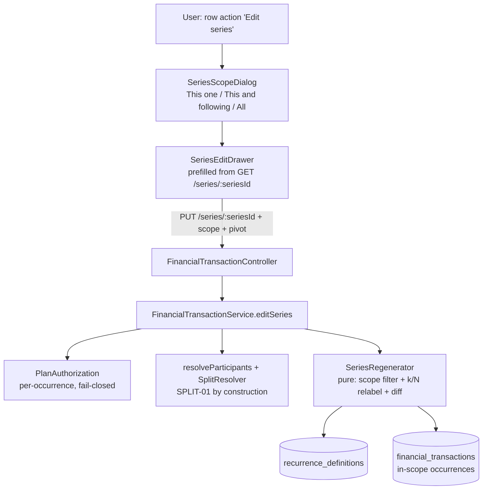
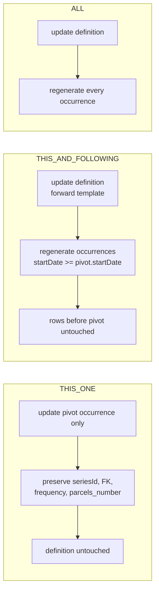

# Series Edit Design

**Spec**: `.specs/features/series-edit/spec.md`
**Research**: `.specs/features/series-edit/research.md` (D1–D6 locked) + spec D7–D10
**Status**: Draft — awaiting approval before Tasks
**Date**: 2026-07-16

> All identifiers, labels, and copy are English-only (system-wide rule). Edit scopes: **This one / This and following / All**.

---

## Architecture Overview

Introduce a first-class **`RecurrenceDefinition`** entity that owns a series' forward-looking template. Existing occurrences gain a nullable FK to it; a one-time V8 migration backfills one definition per existing `series_id`. Editing a series routes through a **single new endpoint** that branches on an explicit **scope** (This one / This and following / All) and, for the bulk scopes, **regenerates the in-scope occurrences** from the definition — re-resolving splits so SPLIT-01 holds by construction.

The schema change is **additive and low-risk** (new tables + one nullable column + a metadata-only backfill), mirroring exactly how V6 (participants) and V7 (items) were added. `series_id` and the legacy per-row `frequency`/`parcels_number` are **kept** for backward compatibility; the definition becomes the source of truth going forward (this is what "retire `frequency`" / resolving **B-001** means — the enum now lives on the definition, the free-text column is demoted, not dropped).



### Edit flow by scope



---

## Data Models

### `RecurrenceDefinition` (new — `models/RecurrenceDefinition.java`)

Owns the schedule + forward-looking value template for one series. Self-contained: everything needed to (re)generate occurrences lives here, so a future rolling-window job (D5) never needs to read existing rows.

```
id                  bigint, IDENTITY, PK
plan                @ManyToOne(optional=false) -> Plan            (plan_id)
createdBy           @ManyToOne(optional=false) -> User            (created_by)
category            @ManyToOne(optional=true)  -> FinancialTransactionCategory (category_id)
seriesId            String, NOT NULL, UNIQUE     (the existing UUID; 1:1 with a definition)
type                enum STRING FinancialTransactionType (CREDIT/DEBIT), NOT NULL
amount              BigDecimal numeric(38,2), NOT NULL     (forward template amount)
description         String, NOT NULL             (BASE description, no "(k/N)" suffix)
mode               enum STRING RecurrenceMode (INSTALLMENT/RECURRING), NOT NULL
recurrenceInterval enum STRING RecurrenceInterval (MONTHLY), nullable
parcelsNumber       Integer, nullable            (installment total N; null for recurring)
firstParcel         Integer, nullable            (installment starting k; default 1; null for recurring)
startDate           LocalDate, NOT NULL          (schedule anchor = date of firstParcel)
endDate             LocalDate, nullable          (recurring end; null for installment)
splitMode           enum STRING SplitMode, NOT NULL default EQUAL
generatedThrough    LocalDate, nullable          (rolling-window watermark; UNUSED in v1, reserved for D5)
participants        @OneToMany(cascade=ALL, orphanRemoval=true) -> RecurrenceDefinitionParticipant
```

**k/N is position-derived, never parsed:** for the occurrence at ordered index `i` (0-based, ordered by `startDate`), `k = firstParcel + i` and `N = parcelsNumber`. This is exactly the generator's existing relationship (`date = startDate.plusMonths(parcel - firstParcel)`), so it round-trips with no description string-parsing.

### `RecurrenceDefinitionParticipant` (new — `models/RecurrenceDefinitionParticipant.java`)

Mirrors `TransactionParticipant`; the split template that lets the definition regenerate independently.

```
id           bigint IDENTITY PK
definition   @ManyToOne(optional=false) -> RecurrenceDefinition (recurrence_definition_id)
member       @ManyToOne(optional=false) -> User                 (member_user_id)
shareAmount  BigDecimal numeric(38,2), NOT NULL
UNIQUE (recurrence_definition_id, member_user_id)
```

### `FinancialTransaction` (modified)

Add one nullable field; everything else unchanged (including `seriesId`, `frequency`, `parcelsNumber` — kept for back-compat):

```
recurrenceDefinition @ManyToOne(optional=true) -> RecurrenceDefinition (recurrence_definition_id, nullable)
```

**Relationships:** one `RecurrenceDefinition` ↔ many `FinancialTransaction` occurrences (via `recurrence_definition_id`) and 1:1 with a `series_id`. Non-series transactions have `recurrence_definition_id = NULL`.

---

## Migration — `V8__add_recurrence_definitions.sql`

Pure SQL, additive, metadata-only backfill (**never rewrites an occurrence's visible values** — SEDIT-01). Mirrors V6 style (identity sequence, named PK/UK/FK, `ON DELETE CASCADE` for owned children, `numeric(38,2)` for money).

1. `CREATE TABLE public.recurrence_definitions (...)` with identity `id`, named `recurrence_definitions_pkey`, `uk_recurrence_definitions_series_id UNIQUE (series_id)`, FKs `fk_recdef_plan`, `fk_recdef_created_by`, `fk_recdef_category`, indexes on `plan_id` and `series_id`.
2. `CREATE TABLE public.recurrence_definition_participants (...)` mirroring `transaction_participants` (FK `fk_recdef_participants_definition ... ON DELETE CASCADE`, `fk_recdef_participants_member`, `uk_recdef_participants_def_member`).
3. `ALTER TABLE public.financial_transactions ADD COLUMN recurrence_definition_id bigint;` + `fk_ft_recurrence_definition` + `idx_ft_recurrence_definition_id`.
4. **Backfill (declarative):**
   - `INSERT INTO recurrence_definitions (...) SELECT DISTINCT ON (series_id) plan_id, created_by, series_id, category_id, type, amount, split_mode, CASE WHEN parcels_number IS NOT NULL THEN 'INSTALLMENT' ELSE 'RECURRING' END, 'MONTHLY', parcels_number, <firstParcel>, <baseDescription>, min(start_date) per series ... FROM financial_transactions WHERE series_id IS NOT NULL ORDER BY series_id, start_date` — one definition from the **earliest occurrence** per series.
     - `firstParcel` = `substring(description from '\((\d+)/\d+\)')::int` on the earliest occurrence, fallback `1` (installments only; NULL for recurring).
     - `baseDescription` = `regexp_replace(description, '\s*\(\d+/\d+\)\s*$', '')` (strip the k/N suffix; recurring rows have no suffix → unchanged).
     - `endDate` = for RECURRING `max(start_date)` per series; for INSTALLMENT `NULL`.
   - `UPDATE financial_transactions ft SET recurrence_definition_id = rd.id FROM recurrence_definitions rd WHERE ft.series_id = rd.series_id;`
   - `INSERT INTO recurrence_definition_participants (recurrence_definition_id, member_user_id, share_amount) SELECT rd.id, tp.member_user_id, tp.share_amount FROM recurrence_definitions rd JOIN (earliest occurrence id per series) e ON e.series_id = rd.series_id JOIN transaction_participants tp ON tp.transaction_id = e.txn_id;`

**Integrity gate before trusting the switch** (like Round-1 B1): after backfill on a copy DB, assert (a) exactly one definition per distinct non-null `series_id`, (b) every series occurrence has a non-null FK, (c) no occurrence's `amount`/`description`/`category`/participants changed.

---

## Components

### Backend

#### `SeriesRegenerator` (new — `services/SeriesRegenerator.java`, pure `@Component`)
- **Purpose**: Given a `RecurrenceDefinition`, resolved participants, a scope, and a pivot date, compute the **target occurrence set** and reconcile it against the existing rows — which to update in place, which to create, which to delete — and stamp each occurrence's `amount`, `description` (base + position-derived `k/N`), `category`, `startDate`, `splitMode`, and fresh participant rows.
- **Interfaces**:
  - `SeriesEditResult reconcile(RecurrenceDefinition def, List<FinancialTransaction> existing, ResolvedParticipants shares, SeriesEditScope scope, LocalDate pivotDate)` → `{ toUpdate[], toCreate[], toDelete[] }`.
  - Pure position math: `int parcelLabel(int index, int firstParcel)`, monthly date stepping via `startDate.plusMonths(i)`.
- **Dependencies**: none (pure); receives already-resolved participants. Delegates raw new-occurrence construction to the existing `RecurringTransactionGenerator` helper where practical.
- **Reuses**: `RecurringTransactionGenerator`'s date/label conventions; `MAX_OCCURRENCES` cap.
- **Tests (required)**: unit tests for scope filtering (This one / following / all + "following from first == all"), k/N position relabel, and count-change diff (add/remove trailing). Mirrors the tested-pure-component pattern of `SplitResolver` / `CategoryBreakdownAssembler` (addresses CONCERNS "no backend test coverage").

#### `FinancialTransactionService.editSeries` (new method)
- **Purpose**: Orchestrate a series edit end-to-end.
- **Signature**: `SeriesEditResponse editSeries(String seriesId, SeriesEditRequestDto dto, PlanContext ctx)`.
- **Algorithm**:
  1. Load `RecurrenceDefinition` by `(plan, seriesId)` → 404 `SeriesNotFoundException` if absent.
  2. Load in-scope occurrences; **authorize each** via `requireCanModifyTransaction(role, occ.createdBy, user)` (fail-closed); `requireCanCreateTransaction` if the edit creates new rows.
  3. Validate: category/type match (existing rule); mode-specific rules (existing `createSeries` validations); **D10** — if `parcelsNumber` changed, require `scope == ALL` else 400.
  4. `resolveParticipants(dto.participants, dto.splitMode, dto.amount, ctx)` → SPLIT-01 by construction.
  5. **THIS_ONE**: update only the pivot occurrence (amount/description-with-relabel/category/split); **preserve** `seriesId`, `recurrenceDefinition`, `frequency`, `parcelsNumber` (fixes the latent nulling bug); do **not** touch the definition.
  6. **THIS_AND_FOLLOWING / ALL**: update the definition's forward template (value fields always; schedule fields only on a range edit); `SeriesRegenerator.reconcile(...)`; `saveAll(toUpdate + toCreate)`, `deleteAll(toDelete)`.
  7. Return summary (`seriesId`, counts).
- **Reuses**: `resolveParticipants`, `SplitResolver`, `RecurringTransactionGenerator`, `planAuthorization`, existing validation + exception types.

#### `editSeries` read path — `getSeriesDefinition`
- `RecurrenceDefinitionResponseDto findSeries(String seriesId, PlanContext ctx)` for form prefill (mode, interval, amount, base description, category, parcelsNumber, firstParcel, dates, splitMode, participants template).

#### `RecurrenceDefinitionRepository` (new)
- `interface RecurrenceDefinitionRepository extends JpaRepository<RecurrenceDefinition, Long>` with `Optional<RecurrenceDefinition> findByPlanAndSeriesId(Plan, String)`.

#### Controller (modified — `FinancialTransactionController`)
- `GET  /series/{seriesId}` → `getSeries` → `RecurrenceDefinitionResponseDto` (200).
- `PUT  /series/{seriesId}` → `editSeries(@PathVariable, @RequestBody @Valid SeriesEditRequestDto, ctx)` → `FinancialTransactionSeriesResponseDto` (200).
- (existing `POST /series`, `DELETE /series/{seriesId}`, `PUT /{id}` unchanged; `createSeries` also now creates + saves a `RecurrenceDefinition` and links occurrences.)

#### DTOs (new)
- `SeriesEditRequestDto` — the series template (like `FinancialTransactionSeriesRequestDto`: type, amount, description(base), categoryId, mode, parcelsNumber, currentParcel, interval, endDate, splitMode, participants) **plus** `SeriesEditScope scope (@NotNull)` and `Long pivotOccurrenceId` (required for THIS_ONE & THIS_AND_FOLLOWING).
- `SeriesEditScope` enum: `THIS_ONE, THIS_AND_FOLLOWING, ALL`.
- `RecurrenceDefinitionResponseDto` — immutable, constructed from the entity (per CONVENTIONS: `final` fields, entity-taking constructor).

### Frontend

#### `SeriesScopeDialog` (new — `features/home/components/transactions/SeriesScopeDialog.tsx`)
- **Purpose**: Three-way scope chooser (This one / This and following / All) before opening the edit form.
- **Pattern**: modeled on `useConfirmDialog.tsx` but resolves an **enum** (`Promise<SeriesEditScope | null>`) instead of a boolean; shadcn `Dialog` (CONVENTIONS: Dialog for auxiliary choices). For installment series, disable/annotate scopes when a range change would force "All" (D10) — or surface that at submit.

#### `SeriesEditDrawer` (new — `features/home/components/transactions/SeriesEditDrawer.tsx`)
- **Purpose**: Sheet-based edit form for a series, prefilled from `GET /series/{seriesId}`, showing recurrence fields (which `TransactionFormDrawer` gates to create-only). Dedicated drawer chosen over extending the 1040-line create/edit drawer to keep that component's create-only recurrence gating untouched (lower risk).
- **Reuses**: shared Field/FieldGroup/split sub-components, `maskCurrency`, react-hook-form + zod (`buildDefaultValues` from the definition DTO, `toPayload` → `SeriesEditRequestDto`), required `mode` prop convention.
- **D10 UX**: if the user changes total parcel count, the scope is pinned to "All" with a clear inline note ("Changing the number of parcels updates the whole series") so behavior is predictable and never surprising.

#### Service hooks (modified — `api/services/useFinancialTransactionService.ts`)
- `useFinancialTransactionSeries(seriesId)` → `GET /plans/{planId}/financial-transaction/series/{seriesId}` (query key `["financialTransactionSeries", planId, seriesId]`).
- `useUpdateFinancialTransactionSeries()` → `PUT .../series/{seriesId}`, `onSuccess` invalidates `["financialTransactions"]` (+ the series key).

#### Wiring (modified)
- `transactionColumns.tsx`: add an "Edit series" row action (next to the existing "Delete series"), guarded by `transaction.seriesId`.
- `TransactionsTab.tsx`: `handleEditSeries` → open `SeriesScopeDialog`, then `SeriesEditDrawer`; pass through `buildTransactionColumns`.
- DTO/types (`api/dtos/financialTransaction.ts`): `SeriesEditScope`, `SeriesEditRequest`, `RecurrenceDefinitionResponse`.

---

## Code Reuse Analysis

| Component | Location | How to Use |
| --------- | -------- | ---------- |
| `SplitResolver` | `services/SplitResolver.java` | Reuse verbatim — cent-based EQUAL keeps SPLIT-01 on regen at new amount |
| `resolveParticipants` / `ResolvedParticipants` | `services/FinancialTransactionService.java:199-229` | Re-resolve shares from the edit DTO at the new amount |
| `RecurringTransactionGenerator` | `services/RecurringTransactionGenerator.java` | Date stepping, `k/N` label convention, `MAX_OCCURRENCES=120` cap |
| `PlanAuthorization.requireCanModify/CreateTransaction` | `services/…` | Per-occurrence fail-closed auth, same as `deleteSeries` |
| `useConfirmDialog` pattern | `components/dialog/useConfirmDialog.tsx` | Template for the promise-based `SeriesScopeDialog` (enum instead of boolean) |
| `TransactionFormDrawer` field sub-components | `features/home/components/transactions/…` | Reuse fields/split UI in `SeriesEditDrawer` |
| V6 migration | `db/migration/V6__add_transaction_participants.sql` | Template for V8 (add table + column + backfill) |

### Integration Points

| System | Integration |
| ------ | ----------- |
| Dashboard | Occurrences stay real rows; regeneration preserves SPLIT-01 → top-line + per-category totals stay correct with no dashboard change |
| `createSeries` | Now also creates a `RecurrenceDefinition` + links occurrences (so new series are edit-ready) |
| `deleteSeries` | Unchanged (by `series_id`); `ON DELETE` leaves the definition — add optional cleanup of the orphan definition, or leave it inert (decide in Tasks) |

---

## Error Handling Strategy

| Scenario | Handling | User sees |
| -------- | -------- | --------- |
| `seriesId` not found | `SeriesNotFoundException` | 404 |
| Actor lacks rights on any in-scope occurrence | `requireCanModifyTransaction` throws, fail-closed | 403/404, no partial edit |
| EXACT shares don't sum to amount | `SplitResolver` `IllegalArgumentException` | 400 with message |
| Category type ≠ transaction type | existing validation | 400 |
| Range change would exceed `MAX_OCCURRENCES` | `ensureWithinCap` | 400 |
| Parcel-count change with scope ≠ ALL (D10) | service validation | 400; FE also pins scope to All |
| No field actually changed | idempotent no-op rewrite | 200, no spurious churn |

---

## Tech Decisions (non-obvious)

| Decision | Choice | Rationale |
| -------- | ------ | --------- |
| Schema shape | Additive: new tables + nullable FK; keep `series_id` + legacy `frequency`/`parcels_number` | Low-risk, mirrors V6/V7; no destructive rewrite; legacy columns demoted not dropped (drop deferred) |
| Definition self-containment | Persist the participant template on the definition (child table) | Lets the future rolling-window job (D5) generate without reading occurrences; faithful to research D1 |
| k/N derivation | Position-derived (`firstParcel + index`), never parse descriptions | Robust relabel; matches the generator's existing date↔parcel relationship |
| Endpoint shape | One `PUT /series/{seriesId}` branching on `scope` | Single FE flow; THIS_ONE reuses the occurrence-update logic (and fixes its nulling bug) |
| Split integrity on regen | Re-resolve via `SplitResolver` at the new amount | SPLIT-01 holds by construction, no bespoke math |
| Count-change scope | Force ALL (D10) | Predictable; never a mixed `4/12`+`5/18` series |
| FE form | Dedicated `SeriesEditDrawer` (not extend the create/edit drawer) | Keeps the 1040-line drawer's create-only gating untouched; lower risk |
| Regeneration logic | Extract pure `SeriesRegenerator` with unit tests | Testable core; addresses CONCERNS "no backend tests" |

---

## Open for Tasks

- Whether `deleteSeries` should also delete the now-orphan `RecurrenceDefinition` (cleanup) or leave it inert. Lean: delete it (keep DB tidy).
- Exact `SeriesEditDrawer` composition (fully dedicated vs. a thin wrapper over shared field groups) — resolve when breaking down FE tasks.
- P2 (SEDIT-11/12, range change) can be a **separate execution pass** after P1 ships, exactly like Expense Items P1→P2.
